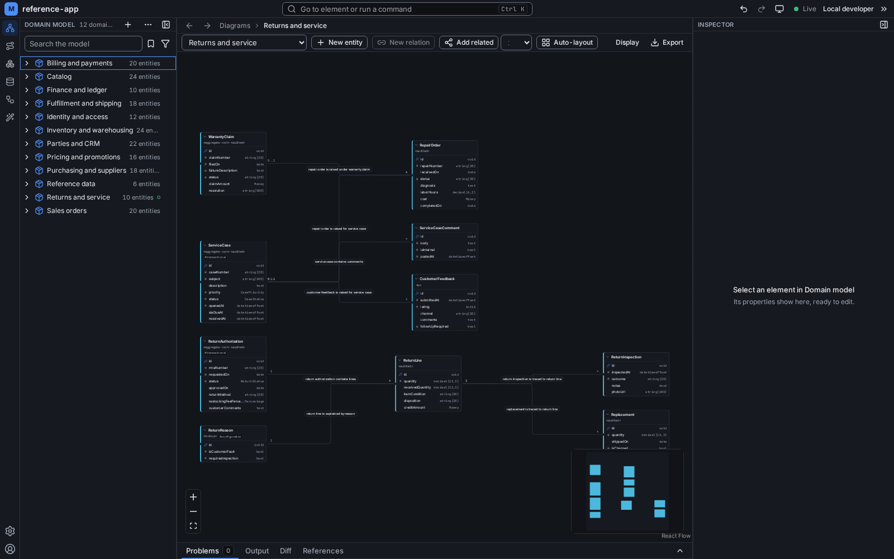
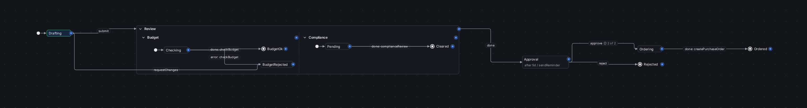

# Maquettiste

Maquettiste is a visual designer for entities, relations, processes and databases that generates code through template
packs your team owns. An editor, a command line and an agent server all work over one model, kept as JSON files in your
repository.



## What you get

- **One model in the repository.** Each domain, entity, relation, enum, process and database is one JSON file under
  `.maquettiste/`, always written in one canonical form, so a change reviews and merges like code
  ([what you are editing](docs/user-guide.md#what-you-are-editing)).
- **An editor.** It has a domain model canvas with element editors, databases that hold only what you map to them,
  reference data with seed rows, and processes as statecharts you can simulate
  ([the explorers and screens](docs/user-guide.md#the-explorers-and-screens)).
- **Generation you control.** Template packs live in the repository and you edit them like any other file. A plan says
  why each file renders before you apply it, and `generate --check` fails a CI job when the committed output no longer
  matches the model ([generation](docs/user-guide.md#generation-how-the-model-becomes-files)).
- **An agent server.** `maquettiste mcp` serves the model to coding agents over the Model Context Protocol, through the
  same write path as the editor. Its tools read, change, validate and generate the model, 60 today
  ([docs/mcp.md](docs/mcp.md)).
- **A command line.** The same engine without the editor, for terminals and CI
  ([the command line](docs/user-guide.md#the-command-line)).
- **Localization.** The names, labels and descriptions of the model translate per locale, with XLIFF and CSV files for
  translators ([translating the model](docs/user-guide.md#translating-the-model-in-the-editor)).

Processes are statecharts. A lifecycle gives one entity its states, and an orchestration coordinates people, systems and
other processes. The simulation panel runs a process step by step and records a run as a scenario. The engine replays
every scenario as a test, and the example packs generate code and documentation from processes
([processes, actors and scenarios](docs/user-guide.md#processes-actors-and-scenarios)).



## Getting started

You need Docker or Podman. One image, `mattjcowan/maquettiste:<tag>`, carries the editor, the command line and the agent
server. The current tag is in [docs/demo.md](docs/demo.md) and on the
[registry](https://hub.docker.com/r/mattjcowan/maquettiste). Use the same tag everywhere below. With Podman, type
`podman` where this says `docker`.

Save this as `maquettiste.compose.yaml` in the root of your repository, with the tag filled in:

```yaml
services:
  maquettiste:
    image: mattjcowan/maquettiste:<tag>
    user: "0:0"                                                     # starts as root, then runs as the owner of .maquettiste/
    ports: ["127.0.0.1:8080:8080"]
    volumes:
      - maquettiste-host:/data                                      # the editor's own state (users, keys, index cache)
      - ./.maquettiste:/data/sites/maquettiste.localhost/data       # the model
      - ./:/repo                                                    # the repository: generated files land here
    environment:
      MAQUETTISTE_REPO_ROOT: /repo
      MAQUETTISTE_UID: ${MAQUETTISTE_UID:-}                         # optional override; empty = the owner of .maquettiste/
      MAQUETTISTE_GID: ${MAQUETTISTE_GID:-}
      MAQUETTISTE_EDITOR_TOKEN: ${MAQUETTISTE_EDITOR_TOKEN:-}
volumes:
  maquettiste-host:
```

Run `init` before the first `up`. Otherwise Docker creates `.maquettiste/` empty and the editor starts on a project with
no settings.

### Mac

```zsh
cd <your repository>
docker run --rm --user 0:0 -v "$(pwd -P):/repo" -w /repo mattjcowan/maquettiste:<tag> maquettiste init
export MAQUETTISTE_EDITOR_TOKEN=$(openssl rand -hex 24)
docker compose -f maquettiste.compose.yaml up -d
```

Open http://maquettiste.localhost:8080. Docker Desktop on the Mac may show the sign-in page, because the browser's
requests reach the container from another address: paste the token (`echo $MAQUETTISTE_EDITOR_TOKEN | pbcopy`). The
repository must sit in a folder Docker shares with containers (your home folder is shared by default). `$(pwd -P)` mounts
the real path of the folder, which file sharing needs when you reached it through a link. An agent client started from
the Dock does not inherit your shell's `PATH`, so the entry `init --mcp --docker` writes adds `/opt/homebrew/bin`,
`/usr/local/bin` and `$HOME/.docker/bin` to find `docker`.

### Linux

```sh
cd <your repository>
docker run --rm --user 0:0 -v "$PWD:/repo" -w /repo mattjcowan/maquettiste:<tag> maquettiste init
docker compose -f maquettiste.compose.yaml up -d
```

Open http://maquettiste.localhost:8080. Nothing else is needed. The container runs as the owner of the folder, so the
model and the generated files stay yours, and there is no sign-in in local mode. Rootless Podman works with the same file.

### Windows with WSL

Run the Linux commands in a WSL terminal. Keep the repository in the WSL filesystem (for example `~/src`), not under
`/mnt/c`: file access across the Windows drive is slow, and file change events from Windows do not reach Linux. WSL
forwards the port to Windows, so open http://maquettiste.localhost:8080 in a Windows browser. If Windows already uses
port 8080, change the ports line to another host port, such as `"127.0.0.1:8094:8080"`, and open that port. With Docker
Engine inside WSL there is no sign-in; with Docker Desktop, set a token as on the Mac.

## Updating

A new version is a new image tag. In the repository:

```sh
docker pull mattjcowan/maquettiste:<new tag>
# change the image: line of maquettiste.compose.yaml to the new tag
docker compose -f maquettiste.compose.yaml up -d
docker run --rm --user 0:0 -v "$PWD:/repo" -w /repo mattjcowan/maquettiste:<new tag> maquettiste init
```

`init` refreshes the JSON schema copies under `.maquettiste/.schema/` and keeps everything else. If you registered the
agent server, run `init --mcp --docker mattjcowan/maquettiste:<new tag> --skill` instead. That also replaces the
`.mcp.json` entry with the new tag, refreshes the modeling skill and removes the `mcp.sh` wrapper an earlier version
wrote. Commit the compose file and what `init` changed, so the whole team moves together.

A new version never rewrites your model files. It may report new validation findings, and the next plan may render
files again because the engine changed.

## Agents

`maquettiste init --mcp --docker mattjcowan/maquettiste:<tag>` writes a `maquettiste` entry to `.mcp.json` that runs
`maquettiste mcp` in the image over the repository, so any MCP client started there can use it. Add `--skill` for the
modeling skill; [docs/mcp.md](docs/mcp.md) shows the entry and lists the tools.

## Command line

The image carries the CLI. A shell function makes it a local command:

```sh
maquettiste() { docker run --rm $([ -t 0 ] && echo -it) --user 0:0 -v "$PWD:/repo" -w /repo mattjcowan/maquettiste:<tag> maquettiste "$@"; }
```

```sh
maquettiste validate             # checks the model and the packs, and replays every scenario
maquettiste generate             # renders the packs into the output roots, incrementally
maquettiste generate --check     # exits 2 when any output would be added, changed or deleted
```

The user guide has a variant that reads the tag from the compose file, so the editor, the CLI and the agent server agree
([from the Docker image](docs/user-guide.md#from-the-docker-image)). With the .NET SDK, the CLI is also a .NET tool:
`dotnet tool install -g Maquettiste.Cli --prerelease`.

## Documentation

- [docs/user-guide.md](docs/user-guide.md): the editor, generation, processes and the command line.
- [docs/mcp.md](docs/mcp.md): the agent server and its tools.
- [docs/demo.md](docs/demo.md): a 20-minute walkthrough in an existing repository.
- [docs/engineering/status.md](docs/engineering/status.md): what each phase delivered and what each gate measured.
- [docs/engineering/](docs/engineering/): the design documents.
- [SPEC.md](SPEC.md): the specification.

## Building from source

The .NET SDK pinned in `global.json` builds the engine, the CLI and the editor's functions:

```sh
dotnet build maquettiste.slnx   # warnings are errors
dotnet test maquettiste.slnx
cd src/editor && npm ci && npm test
```

The image, the bench and the end-to-end tests are in [the development notes](.claude/skills/maquettiste-dev/SKILL.md).

## License

MIT. See [LICENSE](LICENSE).
