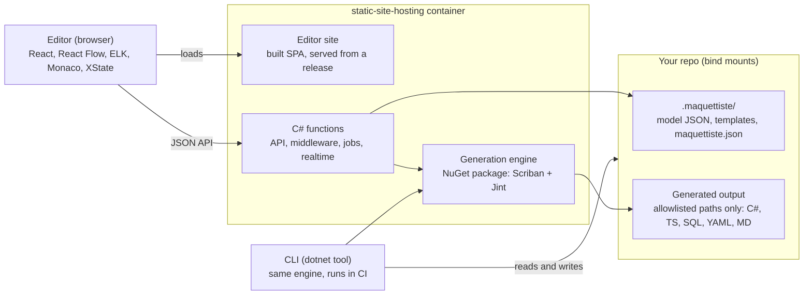
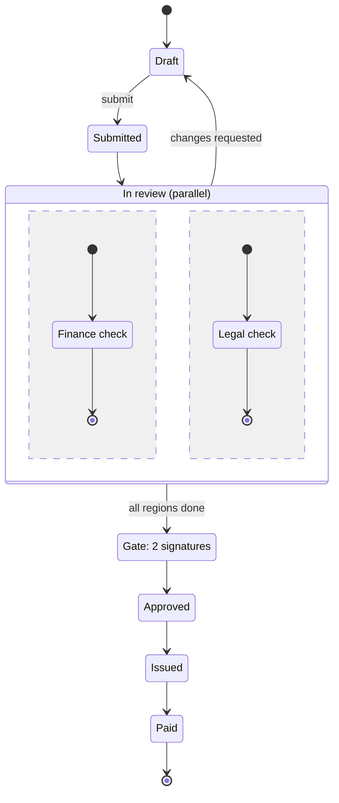
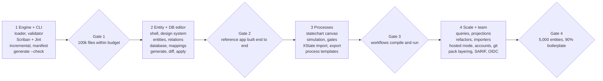

# Maquettiste Specification

Sep 27, 2026 · @Matt C.

Maquettiste is an open-source (MIT) visual designer for entities, relations, processes and databases that generates code from fully custom templates. Models live as JSON inside the repo they describe, and one generation run should be able to emit 100,000+ files covering roughly 90% of an application's boilerplate and essential background code.

## 1. Goals and scope

Maquettiste turns one version-controlled model into most of an application's code: entities, persistence, processes and the plumbing around them, in any language or file format.

**Goals**

- One visual tool for business entities, named relations (with attributes on the relation), processes (statecharts) and physical databases.
- A database designer coupled to the entity model, plus a mapping layer, so repositories and data access can be generated over entities and tables.
- Fully custom templates. Scriban renders, Jint runs JavaScript helpers, and output is any text: C#, TypeScript, SQL, YAML, JSON, Markdown, CSS, JS. No target language is built in.
- Runs anywhere Docker runs, macOS (including Apple silicon) first. This fills the gap left by Windows-only designers such as LLBLGen Pro and the Visual Studio EF designer.
- Two modes from one build: local, per developer over a bind-mounted repo; and hosted, one `static-site-hosting` instance where a team browses and edits the same model at once, with accounts, presence and git built in.
- Everything lives in the consuming repo: model, templates and generated output are all reviewable in pull requests.
- Scale: 100,000+ generated files per run, covering roughly 90% of an application's boilerplate and essential background code.

**Non-goals**

- Not a runtime, ORM or low-code platform. Output is plain code the team owns and can stop generating at any time.
- No official framework target. Template packs ship as examples, never as the product.
- Not a multi-tenant SaaS. A team self-hosts one instance for one or more repos; there is no shared cloud service.
- Not tied to any client product, code base or UI kit. It is an independent MIT project under `mattjcowan/maquettiste`, like `static-site-hosting`.

**Success measures (proposed targets)**

| Measure | Target |
| --- | --- |
| Full generation, 100,000 files, cold cache | 60 s or less on an 8-core laptop |
| Incremental generation after editing one entity | 2 s or less |
| Model size handled by the editor | 5,000 entities, 20,000 relations |
| One diagram on screen | 300 nodes at a smooth 60 fps |
| Determinism | Byte-identical output on any machine and OS for the same model and templates |
| Boilerplate coverage | About 90% of non-business-logic code in a reference application |
| Hosted mode, concurrent users | 50 people browsing and 10 editing one model at once, with presence, no lost updates, and saves under 300 ms |

## 2. Principles

The repo is the only source of truth, and every other rule follows from that.

1. **The repo is the database.** Models, templates and settings are plain files under `.maquettiste/`. No hidden state lives in the container; deleting it loses nothing.
2. **Model first.** Entities, relations and processes are designed first. The database and code are derived from them through explicit, overridable mappings. Database-first import is a later convenience, not the core loop.
3. **Text in, text out.** The generator knows nothing about any language. It renders text to paths, so a new target is a new template, never a new release.
4. **Deterministic output.** The same model and templates always produce the same bytes: stable ordering, fixed line endings, no timestamps or random ids in output.
5. **Diff-friendly storage.** One file per model element, canonical JSON formatting and sorted keys, so merges and reviews stay small.
6. **Generated code is owned code.** Output is committed and readable. Teams can edit around it (protected regions, partial files) or stop generating without losing anything.
7. **Incremental by default.** Every run computes what changed and writes only those files. Full regeneration is the same path with an empty cache.
8. **Headless parity.** Anything the editor can do to generation, the CLI can do in CI.
9. **Safe by construction.** Templates write only inside allowed paths, and scripts run sandboxed with time and memory limits.
10. **Independent and open.** MIT licensed, permissive dependencies, no code or branding from any client project.

## 3. Architecture

The editor and the CLI drive the same .NET generation engine, so a model produces identical files from the browser or from CI.

One generation engine serves the editor and CI.



Only `.maquettiste/` and allowlisted output paths are writable; the editor itself is baked into the image.

- **Editor.** A static React single-page app built from the `maquettiste` repo and served by the host like any other site. It holds no state beyond the open session.
- **Host.** `static-site-hosting` 0.2.0 or later. It serves the editor site, runs the site's C# functions, and provides the pieces the editor leans on: middleware (sign-in), services and jobs (index cache, file watcher, generation worker), a realtime hub (progress and change events), variables (host-level settings) and optional AI.
- **Functions.** Thin: HTTP handlers, one middleware, two realtime hooks, one AI hook, a `[ConfigureServices]` method and two background services. All the logic is in the engine package, which keeps the functions well under the host's limits (50 files, 4 MB).
- **Engine.** `Maquettiste.Engine`, a NuGet package: model loader, validator, dependency graph, Scriban renderer, Jint script host, output writer. The functions reference it with `#:package`, and the CLI references the same package.
- **CLI.** A `dotnet tool` (`maquettiste`) that runs the engine directly against a checkout, with no container or browser, for CI and scripts.

## 4. Deployment and repo layout

One image, built on `static-site-hosting`, runs in two modes: **local**, where a developer bind-mounts their repo and works alone, and **hosted**, where a team shares one instance that holds its own git checkout. The editor, functions and engine are the same build in both.

**Folder layout in a consuming repo**

```
repo/
├── .maquettiste/
│   ├── maquettiste.json          # project settings, output roots, path allowlist, formatters
│   ├── manifest/<pack>.json      # committed: generated paths + content hashes, one file per pack
│   ├── model/
│   │   ├── entities/             # one file per entity
│   │   ├── relations/
│   │   ├── enums/
│   │   ├── types/                # value objects, custom scalar types
│   │   ├── processes/
│   │   ├── operations/           # commands, domain events
│   │   ├── databases/<db>/       # tables/, views/, sequences/
│   │   ├── mappings/
│   │   ├── seeds/                # reference data rows
│   │   ├── diagrams/             # canvas views: members and positions only
│   │   └── vocabularies/         # tags, categories, stereotypes, actors, naming rules
│   ├── templates/<pack>/         # pack.json, *.scriban, *.js helpers, partials
│   ├── extensions/               # custom property schemas, validation rules
│   └── .cache/                   # gitignored: journal only; the index cache lives on the host volume
└── src/ …                        # generated and hand-written code side by side
```

**Compose file**

```yaml
services:
  maquettiste:
    image: mattjcowan/maquettiste:latest        # built on static-site-hosting 0.2.0+
    ports: ["127.0.0.1:8080:8080"]
    volumes:
      - maquettiste-host:/data                                      # host config, users, keys, index cache
      - ./.maquettiste:/data/sites/maquettiste.localhost/data       # the model
      - ./:/repo                                                    # output root
    environment:
      MAQUETTISTE_REPO_ROOT: /repo
      MAQUETTISTE_EDITOR_TOKEN: ${MAQUETTISTE_EDITOR_TOKEN:-}       # optional; empty = loopback only
volumes:
  maquettiste-host:
```

**Rules**

- **Editor address.** The editor is deployed to the site `maquettiste.localhost`; browsers resolve `*.localhost` to the local machine, so it opens at `http://maquettiste.localhost:8080` with no hosts-file edits.
- **First boot.** `/data` is a named volume and starts empty, so the image carries the editor zip (`site.zip` with `_functions/`) and a startup step deploys it through the host's own API when the site is missing or older than the image. The zip's `_functions/` reference `Maquettiste.Engine` with `#:package`; the image ships that package in a local NuGet source so the first build needs no network.
- **Model mount.** Functions receive the site's data folder (`ISite.Data`, or a `DirectoryInfo` parameter); the compose file bind-mounts `.maquettiste/` onto it, so every save lands in the repo.
- **Output mount.** Output can go anywhere in the repo, so the repo root is mounted at `/repo`. Writes are refused unless the path matches an `allow` root in `maquettiste.json` and no `deny` rule (`.git/` and `.maquettiste/` are always denied).
- **Host-level settings as site variables.** The editor zip declares `MAQUETTISTE_REPO_ROOT` (default `${env:MAQUETTISTE_REPO_ROOT}`) and the secret `MAQUETTISTE_EDITOR_TOKEN` (default `${env:MAQUETTISTE_EDITOR_TOKEN}`) in `_variables.json`. Repo-level settings stay in `maquettiste.json`; nothing about a machine goes in the repo.
- **Manifest and cache.** `manifest/<pack>.json` files are committed so any machine, including CI, can detect orphans and hand edits. The in-memory index cache is written to the host volume (`/data/sites/maquettiste.localhost/data` is the model, so the cache goes under `/data/config/`-style host storage keyed by repo path), never through the bind mount.
- **Local only by default.** The port binds to `127.0.0.1`, and the editor's middleware admits loopback requests without a token. A non-loopback deployment must set `MAQUETTISTE_EDITOR_TOKEN` (Section 19).
- **File ownership.** The host runs as UID 1654, so on Linux the bind-mounted folders need that owner, or the image must support running as the developer's UID so generated files stay theirs. Docker Desktop on macOS maps ownership automatically.
- **Editor development loop.** Sites are served from immutable releases, so working on the editor itself is `vite build --watch` plus a script that zips `dist/` and posts it to `/api/v1/sites/maquettiste.localhost/deploy`; a deploy takes a second or two and never restarts the host. The editor listens for the host's `site.deployed` realtime event and reloads itself.
- **Health.** `GET /healthz` answers on any host, for compose health checks and the CLI's "is the editor up" check.

**Hosted mode**

In hosted mode nothing is bind-mounted. The site's data folder belongs to the host, and the repo is a git checkout inside it, so accounts and sessions never touch the repo:

```
/data/sites/models.example.com/data/
├── accounts.db          # editor users, sessions, invites (SQLite; secrets encrypted with the host's data-protection keys)
├── locks.json           # soft locks, rebuilt from realtime presence on startup
├── cache/               # index cache, run journal
└── repos/<name>/        # one git checkout per configured repo; .maquettiste/ lives inside each
```

- **Setup.** An editor admin registers a repo (URL, branch, credential) under Settings; a background job clones it, and users pick a repo from the top bar. One instance can serve several repos.
- **Shared branch.** Everyone edits the same branch. Per-element ETags refuse stale saves (409, both versions shown), and soft locks over realtime warn a second editor before they save. Per-user branches are a later enhancement.
- **Git from the editor.** Status, commit, pull with rebase and push, run through the `git` CLI that the host's SDK image already carries. The commit author is the signed-in user, so history stays attributable without per-user branches. A rebase conflict on model files is resolved by the canonical-JSON merge; anything else is surfaced as a conflict to fix in the editor.
- **Credentials.** The push credential (deploy key or token) is a secret site variable, `MAQUETTISTE_GIT_TOKEN` or a mounted key, set by a host administrator.
- **Generation.** Plan, diff and apply all run on the instance. Apply writes committed roots (migrations, specs, docs) into the checkout for review and commit; built roots are gitignored and regenerated wherever a build runs, so the shared server never carries the 100k-file write.
- **Sizing.** The model index is one in-memory singleton shared by every request, so reads scale with connections, not users; the host's realtime hub allows 1,000 pages per site.
- **In front.** TLS at a reverse proxy, `TRUST_FORWARDED_HEADERS=true`, and a named management host so the editor domain and the deploy UI are separate.

```yaml
services:
  maquettiste:
    image: mattjcowan/maquettiste:latest
    ports: ["80:8080"]
    volumes:
      - maquettiste-host:/data
    environment:
      MANAGEMENT_HOST: deploy.example.com
      TRUST_FORWARDED_HEADERS: "true"
      MAQUETTISTE_MODE: hosted
      MAQUETTISTE_GIT_TOKEN: ${MAQUETTISTE_GIT_TOKEN}
volumes:
  maquettiste-host:
```

## 5. Metamodel overview

The model has three layers: a conceptual layer (entities, relations, processes), a physical layer (databases), and a mapping layer that binds the two. Diagrams are only views over elements; they never own them.

| Concept | Layer | What it is | References |
| --- | --- | --- | --- |
| Package | Conceptual | Namespace that groups elements; drives folders and namespaces in output | Parent package |
| Entity | Conceptual | Business object with identity, attributes, keys and an optional lifecycle | Package, base entity, types, enums, process |
| Attribute | Conceptual | Typed field on an entity, value object or relation | Type or enum |
| Value object | Conceptual | Reusable composite type without identity (Address, Money) | Types, enums |
| Enum | Conceptual | Closed set of named members with optional codes | None |
| Relation | Conceptual | Named association between entities, with roles, cardinality and its own attributes | Two or more entities |
| Process | Conceptual | Statechart: states, transitions, events, guards, actions, gates | Subject entity, actors |
| Operation | Conceptual | A command (mutation) or query on an entity or package, with typed input and output shapes | Entity, projections, actors |
| Event | Conceptual | A domain event with a payload shape, raised by operations or process transitions | Entity, operation, process |
| Actor | Conceptual | Role that raises events, signs gates and holds permissions | None |
| Permission | Conceptual | Actor × element × action (read, create, update, delete, each operation), with an optional row filter | Actor, entity, operation |
| Seed | Conceptual | Reference data rows for an entity or enum lookup (countries, units) | Entity |
| Database | Physical | A store with a dialect (PostgreSQL, SQL Server, MySQL, SQLite, Oracle) | None |
| Schema, table, view, sequence | Physical | Physical objects with columns, keys, indexes, constraints | Database |
| Mapping | Bridge | Binds entity to table, attribute to column, relation to foreign key or junction table | Entity, table |
| Diagram | View | Saved canvas: which elements appear, positions, collapsed state | Any elements |
| Tag | Classification | Free-form label, many per element | Tag vocabulary |
| Category | Classification | One hierarchical classification per element, referenced by id | Category tree |
| Stereotype | Extension | Typed marker that adds custom properties and steers templates (aggregate-root, audited, soft-delete) | Extension schema |
| Template pack | Generation | Templates, helpers and a manifest that turn elements into files | Any elements, by query |

**Fields on every element**

- `id`: a ULID, immutable, used for every reference. Names can change without breaking links.
- `name`, `displayName`, `pluralName` (optional override), `description` (Markdown).
- `tags[]`, `category`, `stereotypes[]`.
- `properties{}`: custom values validated by extension schemas.
- `generation{}`: per-pack hints such as skip, rename or extra template variables.
- `source{}`: provenance when imported (database, OpenAPI, DBML), so re-import can reconcile.

## 6. Entities

An entity is a business object with identity; everything a template needs to know about it lives in its one file.

**Element kinds**

- **Entity**: has identity and a key. May be abstract, may inherit from one base entity.
- **Value object**: composite type without identity (Address, Money, DateRange). Embedded in entities or used as a collection.
- **Enum**: named members with optional integer or string codes, descriptions and a flags option.
- **Custom scalar type**: a named restriction of a built-in type (Email = string, max 254, pattern) reused across attributes.

**Attributes**

| Property | Meaning |
| --- | --- |
| `type` | Built-in scalar keyword, or a reference to an enum, value object or custom scalar |
| `required`, `default` | Nullability and default value (literal or named expression such as `now`) |
| `length`, `precision`, `scale` | Size facets for strings and decimals |
| `collection` | List of the type (value objects, scalars) |
| `unique`, `indexed` | Logical intent; the database layer decides physical indexes |
| `readOnly`, `immutable` | Not settable after create, or never after insert |
| `derived` | Computed from an expression; not stored unless mapped |
| `sensitive` | PII or secret; templates can mask, encrypt or exclude it |
| `validation` | Min, max, pattern, allowed values, custom rule ids |
| `order` | Stable position used for columns, forms and serialization |

**Built-in scalar types**: `string`, `text`, `bool`, `int16`, `int32`, `int64`, `decimal(p,s)`, `float`, `double`, `date`, `time`, `datetime`, `datetimeoffset`, `duration`, `uuid`, `ulid`, `binary`, `json`. Templates map these to language types through per-pack type maps; databases map them through dialect maps.

**Keys and identity**

- Primary key: one attribute or composite. Alternate (natural) keys are named and may be composite.
- Identity strategy: database identity, sequence, UUID v7, ULID, or application-assigned.

**Cross-cutting behaviors as stereotypes**

Stereotypes such as `audited`, `soft-delete`, `versioned` (concurrency token), `tenant-scoped` and `temporal` add their attributes virtually. Templates see those attributes like any other, but they are defined once in the stereotype, not copied into every entity.

**Example entity file**

```json
{
  "$schema": "../../.schema/v1/entity.json",
  "kind": "entity",
  "id": "01JAX3K9V2Q7M4T8W1Z5C6B0DE",
  "name": "Invoice",
  "package": "01JAX3JZ0H6N2P5R8S1T4V7W9Y",
  "description": "A bill issued to a customer.",
  "stereotypes": ["aggregate-root", "audited", "soft-delete"],
  "tags": ["billing"],
  "category": "01JAX3N0RECEIVABLESCAT0001",
  "key": { "attributes": ["01JAX3KA1B2C3D4E5F6G7H8J9K"], "strategy": "uuid-v7" },
  "attributes": [
    { "id": "01JAX3KA1B2C3D4E5F6G7H8J9K", "name": "id", "type": "uuid", "required": true },
    { "id": "01JAX3KB2C3D4E5F6G7H8J9KAM", "name": "number", "type": "string", "length": 32, "required": true, "unique": true },
    { "id": "01JAX3KC3D4E5F6G7H8J9KAMBN", "name": "total", "type": { "ref": "01JAX3M0MONEYVALUEOBJECT01" } },
    { "id": "01JAX3KD4E5F6G7H8J9KAMBNCP", "name": "status", "type": { "ref": "01JAX3M1INVOICESTATUSENUM1" }, "required": true }
  ],
  "lifecycle": "01JAX3P0INVOICELIFECYCLE001"
}
```

## 7. Relations

Relations are first-class, named elements with their own file, so they can carry attributes, tags and stereotypes like entities do.

**Relation properties**

- `name` and `inverseName` as verb phrases ("Customer *places* Invoice", "Invoice *is placed by* Customer").
- `relationKind`: association, aggregation, composition (the child's lifetime is owned), or n-ary (three or more ends).
- `attributes[]`: the same attribute model as entities (Membership between User and Team carries `role` and `joinedOn`).
- `allowDuplicates`: whether the same pair may be linked more than once.
- `ordered`: whether one side keeps a position.

**Each end (role)**

| Property | Meaning |
| --- | --- |
| `entity` | The entity at this end |
| `role` | Role name ("billTo", "approver") |
| `navigation` | Property name generated on the opposite entity; empty means not navigable from there |
| `min`, `max` | Cardinality: 0 or 1 for min, 1 or `*` for max |
| `onDelete` | Logical intent: cascade, restrict, set null, none |

Self-relations (a Category's parent) and several relations between the same two entities (Invoice `billTo` Customer and `shipTo` Customer) are distinguished by role.

**Default physical mapping (overridable in Section 10)**

| Shape | Default |
| --- | --- |
| One to one | Foreign key with a unique constraint on the dependent side |
| One to many | Foreign key on the many side |
| Many to many, no attributes | Junction table with a composite key |
| Any relation with attributes | Junction table whose extra columns hold the attributes |
| N-ary | Junction table with one foreign key per end |
| Promoted relation | A generated association entity with two many-to-one relations; keeps the relation's id |

Whether attributes on a relation always produce a junction table, or may be promoted to an association entity, is a per-relation mapping choice with a project-wide default.

**Example relation file**

```json
{
  "kind": "relation",
  "id": "01JAX4R0MEMBERSHIPRELATION1",
  "name": "is member of",
  "inverseName": "has member",
  "relationKind": "association",
  "ends": [
    { "entity": "01JAX4E0USERENTITY00000001", "role": "member", "navigation": "members", "min": 0, "max": "*" },
    { "entity": "01JAX4E1TEAMENTITY00000001", "role": "team", "navigation": "teams", "min": 0, "max": "*" }
  ],
  "attributes": [
    { "id": "01JAX4R1ROLEATTRIBUTE00001", "name": "role", "type": "string", "length": 40 },
    { "id": "01JAX4R2JOINEDONATTRIBUTE1", "name": "joinedOn", "type": "date", "required": true }
  ],
  "allowDuplicates": false
}
```

## 8. Processes

Processes are statecharts with XState v5 semantics, so one model covers both an entity's lifecycle and a multi-actor workflow with parallel branches, loops back to earlier states and signature gates.

Reviews run in parallel, and a rejection loops back to Draft.



Submitted work enters a parallel state; both regions must finish before the gate, and a change request from either review returns the item to Draft.

**Two uses, one model**

- **Lifecycle**: a process with a `subject` entity (Invoice). Its states can be bound to an enum attribute (`Invoice.status`) so the two never drift.
- **Orchestration**: a process with actors, human tasks, service tasks and sub-processes, with or without a subject entity.

**State kinds**

| Kind | Meaning |
| --- | --- |
| Atomic | A leaf state |
| Compound | Nested states with an `initial` child; serial steps live here |
| Parallel | Orthogonal regions all active at once; `onDone` fires when every region reaches final |
| Final | Ends its parent; the process ends when the root reaches final |
| History | Shallow or deep; re-enters the last active child when returning |
| Choice | A transient branch point resolved by guarded transitions |

**Transitions**

- `event`, `source`, `target` (one or several for entering parallel regions), `guard`, `actions[]`.
- Any transition may target an earlier state; rework loops are normal, not a special case.
- Delayed transitions (`after`: a duration) express timeouts, reminders and SLAs.
- Internal versus external transitions follow statechart rules for entry and exit actions.

**Behavior and data**

- `context`: attributes of the running instance, using the entity attribute model.
- Event payload schemas, so generated APIs and handlers are typed.
- Named `guards` and `actions` with a description and an optional JavaScript expression. Jint evaluates expressions in simulation; templates emit handler stubs for the rest.
- `invoke`: call a sub-process, a service task, or wait on a human task.
- `actors`: roles allowed to raise each event.

**Gates**

A gate is a transition that needs approvals before it fires: N of M signatures, required roles, whether the same person may sign twice, whether a reason is required, and the signature meaning recorded with each approval. Gates generate their own audit records.

**Editor support**

- Nested containers for compound states, dashed separators for parallel regions, and auto-layout through ELK.
- Simulation: raise events, watch the active configuration, evaluate guards.
- Validation: unreachable states, dead ends without final, missing initial states, overlapping guards on the same event.
- The process schema is Maquettiste's own; XState v5 config is an export (a projection), and import accepts XState config that uses named guards and actions. SCXML export later.

**Typical generated outputs**: state enums, transition tables, state machine classes, event DTOs, API endpoints per event, instance and history tables, audit trails for gates, and Mermaid diagrams for documentation.

## 9. Database model

The physical model is computed from the entity model by mapping conventions, then adjusted by table files that store only what differs; designed and imported tables store their full definition.

**Databases and schemas**

- A project may hold several databases, each with a `dialect` (PostgreSQL, SQL Server, MySQL or MariaDB, SQLite, Oracle) and a target version.
- Per database: default schema, naming convention (`snake_case`, `PascalCase`, prefixes), identifier quoting, and the dialect's identifier length limit, enforced by validation.

**Table origin**

| Origin | Stored in its file |
| --- | --- |
| Synthesized (from an entity mapping) | Only overrides: renamed columns, extra indexes, native types |
| Designed (no entity: reporting, staging, legacy) | Full definition |
| Imported (reverse engineered) | Full definition plus `source` provenance |

**Table contents**

- Columns: name, logical type, optional native type override, nullable, default (literal or per-dialect SQL expression), identity or sequence, computed column expression, collation, comment.
- Keys and constraints: primary key, unique constraints, foreign keys with on-delete and on-update actions, check constraints.
- Indexes: columns with sort order, included columns, filtered or partial predicate, unique flag, method (btree, hash, gin, gist, clustered).
- Views with per-dialect SQL bodies, and sequences. Stored routines and partitioning come later.

**Dialect maps**

Each dialect has an editable type map from logical types to native types (`decimal(p,s)` to `numeric(p,s)` on PostgreSQL, `decimal(p,s)` on SQL Server). Projects can override single entries without copying the map.

**Schema diff for migrations**

The engine keeps a committed snapshot of the physical model from the last generation. Templates receive a structured diff (tables, columns, keys and indexes added, altered, renamed or dropped), so a template pack can emit migration scripts for any migration tool. Maquettiste never connects to a database to apply changes.

**Reverse engineering (later phase)**

Import from a live database through the CLI or a function, reconciled by `source` provenance on re-import. DapperMatic's cross-provider schema reading is a candidate for introspection.

## 10. Mapping and data access

Conventions map the whole entity model to tables in one pass; per-element overrides handle the exceptions, and templates receive the fully resolved result, so repository generation is template work rather than engine work.

**Project conventions** (in `maquettiste.json`, per database)

- Table and column naming (for example plural `snake_case`), key column names, foreign key names from role names, index and constraint names.
- Default string length, decimal precision and scale, datetime precision.
- Default storage for enums (integer, string or lookup table) and for value objects (embedded columns, own table, or JSON column).
- Default for relations with attributes: junction table or promoted association entity.

**What maps to what**

| Model element | Mapping options |
| --- | --- |
| Entity | One table; or several tables (vertical split, later) |
| Attribute | One column, with name and native type overrides |
| Value object | Prefixed embedded columns, own table, or JSON column |
| Collection of value objects | Child table or JSON column |
| Enum | Integer, string, or lookup table with seed rows |
| Relation | Foreign key, junction table, or promoted association entity |
| Inheritance | Table per hierarchy (discriminator column), table per type, or table per concrete type |
| Entity in several databases | One mapping per database (write store, reporting store) |

**Queries, projections, operations and events**

To reach roughly 90% boilerplate coverage, data access needs more than CRUD, so five optional element kinds sit beside entities:

- **Queries**: named finders with parameters, a filter in a small predicate language (comparisons, `in`, null checks, traversal across relations), sort, paging and an optional projection. Templates render them per dialect with engine helpers.
- **Projections**: named shapes of an entity (field subsets, flattened relation fields, computed fields) that become DTOs, API contracts and read models.
- **Operations**: commands and queries with typed input and output shapes (a projection or an inline shape), the actor allowed to call them, and the events they raise. CRUD operations are implied for every entity and can be switched off per entity.
- **Events**: domain events with a payload shape, raised by operations or by process transitions, so handlers, outbox tables and message contracts can be generated.
- **Permissions and seeds**: an actor × element × action matrix with optional row filters, and reference data rows, so authorization checks and seed scripts come from the model too.

**The resolved model templates see**

For each entity and database: table, columns in order, keys, foreign keys, join paths for every navigation, inheritance strategy, discriminator values, queries with their resolved joins, projections, and the dialect's type for every column.

**Data access targets**

The engine is target-agnostic. Example packs show the range: Dapper or DapperMatic repositories, an EF Core `DbContext` with configurations, raw SQL DDL, and TypeScript types and clients. A team's own pack is the expected end state.

## 11. Model file format

Every model element is one small, canonically formatted JSON file referenced by a permanent id, so hand edits, merges and reviews behave like ordinary code.

**Files and names**

- One file per element, in a folder per kind (Section 4). The file name is the element's kebab-case name (`invoice.json`); a short id suffix is added only on a name collision.
- Renaming an element renames its file in the same save, which git records as a rename.
- Diagram files hold only membership, positions and view state, so rearranging a canvas never touches model files.
- Long descriptions may live in a sidecar Markdown file (`"description": { "file": "invoice.md" }`).

**Identity and references**

- Ids are ULIDs, created by the editor or CLI and never changed.
- Every reference between elements uses the id. Built-in scalar types use keywords.
- A dangling reference is a validation error, never a silent drop.

**Canonical form** (the engine rewrites any file it saves into this form)

- UTF-8 without BOM, LF line endings, two-space indent, trailing newline.
- Keys in the order fixed by each schema's \`x-order\` list, which reads better than alphabetical; arrays in their meaningful order (`order` for attributes).
- Default values omitted, so files stay sparse and diffs stay small.

**Schemas and validation**

- JSON Schema files per format version are written to `.maquettiste/.schema/v1/`, and each file's `$schema` points at them, so VS Code validates and autocompletes with no network.
- Semantic validation (references, cycles, naming limits, mapping conflicts) runs in the engine on load and on every save.

**Versioning and migration**

- `maquettiste.json` records `formatVersion`. `maquettiste migrate` upgrades a repo in one reviewable commit; the editor offers the same and never migrates silently.

**Concurrent and external edits**

- A file watcher (a \`\[BackgroundService\]\` in the editor's functions) picks up edits from git pulls, branch switches and text editors, and refreshes the open editor.
- Each save carries the file's content hash as an ETag. If the file changed on disk since it was loaded, the save is refused with 409 and the editor shows both versions.

**Fast load at scale**

On load the engine builds an in-memory index (ids, names, reverse references). It caches the index in `.cache/`, keyed by file hash, so a 50,000-file model reopens in seconds.

## 12. Code generation engine

The engine expands template packs into render units (one template applied to one element or scope), renders only the units whose inputs changed, and writes only files whose bytes changed.

Only units whose inputs changed are rendered and written.

1. **Load model**: files plus the index cache.
2. **Validate**: stop on any error.
3. **Resolve**: conventions and mappings.
4. **Plan units**: template times element.
5. **Skip unchanged**: input hash per unit.
6. **Render in parallel**: Scriban plus Jint.
7. **Post-process**: regions and formatters.
8. **Write and manifest**: changed files and orphans.

A dry run stops after stage 7 and returns a per-file diff instead of writing.

**Template packs**

A pack is a folder under `.maquettiste/templates/<pack>/`, or a versioned package pulled in by reference (Section 18):

```
sql-ddl/
├── pack.json           # name, version, engine range, parameters, units
├── table.scriban
├── _columns.scriban    # partial, included by other templates
├── helpers.js          # Jint functions exposed to Scriban
└── types/postgres.json # type map overrides
```

**Units in `pack.json`**

```json
{
  "name": "sql-ddl",
  "version": "1.0.0",
  "engine": ">=1.0 <2.0",
  "parameters": { "schemaPerPackage": false },
  "units": [
    {
      "id": "table",
      "template": "table.scriban",
      "for": "each table",
      "where": { "database": "main", "notTags": ["external"] },
      "output": "db/{{ table.schema }}/tables/{{ table.name }}.sql",
      "mode": "overwrite",
      "formatter": "sql"
    }
  ]
}
```

- `for` scopes: `model`, `each package`, `each entity`, `each relation`, `each enum`, `each value object`, `each process`, `each table`, `each query`, `each projection`, or a JavaScript selector returning any element list.
- `where` filters: tags, stereotypes, categories, packages, or a JavaScript predicate.
- `output` is a Scriban expression. A template may also emit zero or many files through `file` blocks, for aggregates such as one registration file per package.

**Template context**

`model` (the resolved model), the current `element`, `pack.params`, the resolved mapping for that element, `schemaDiff` (Section 9), and helper functions.

**Built-in helpers**

Casing (`pascal`, `camel`, `snake`, `kebab`), pluralize and singularize with a project override list, type mapping per target (`type_of attr "csharp"`), per-dialect SQL quoting and literals, indentation, and escaping for Markdown, XML and JSON.

**Delimiters.** Scriban's `{{ }}` collides with Handlebars, JSX, Go templates and Angular output. A unit can set `delimiters` (for example `<% %>`), and Scriban's raw blocks (``) pass literal braces through.

**Jint scripting**

JavaScript files register helpers, selectors, filters and pre-render transforms. Scripts see a read-only model, get no CLR or file access, and run under time and memory limits. `Date.now` and `Math.random` are replaced with deterministic versions.

**Output modes**

| Mode | Behavior |
| --- | --- |
| `overwrite` | Fully generated; rewritten when inputs change (default) |
| `once` | Scaffold written only if missing; the team owns it afterwards |
| `regions` | Regenerated, but protected regions (`maquettiste:keep id=…`) keep their hand-written content |
| `pair` | Writes a generated file every time and its companion once, with suffixes the pack defines (`.g.cs` and `.cs`, `.generated.ts` and `.ts`), for partial classes and extension modules |

**Committed versus built**

Each output root in `maquettiste.json` declares `commit: true | false`, and the choice follows who consumes the output:

| Root kind | Default | Examples |
| --- | --- | --- |
| Built (gitignored, generated on every build) | `commit: false` | C# entities and repositories, TypeScript types and clients, generated tests |
| Committed (applied or published, not compiled) | `commit: true` | SQL migrations, OpenAPI specs, protobufs shared with other repos, docs, seed scripts |

- `maquettiste init` writes the `.gitignore` entries for built roots. The manifest for a built root lives in `.cache/`; only committed roots keep a manifest under `.maquettiste/manifest/`, and `--check` covers committed roots only.
- `regions` mode works only on committed roots. On built roots the customization pattern is `pair` and `once`, with the hand-written half in a committed path (partial classes, extension modules).
- A clean clone pays one full run; every later build is the incremental path. A git `post-checkout` hook can prime built roots so IDE IntelliSense works before the first build.
- A later add-on for C# only: a Roslyn source generator that runs the engine in-process, so C# output never touches disk.

**Hand edits, orphans and headers**

- The manifest stores the hash of every file last written. A generated file whose disk content differs is reported as a hand edit; the policy is `fail` (the CI default), `overwrite` or `skip`.
- Files in the manifest that the current run no longer produces are orphans: deleted on apply, listed in a dry run.
- Templates can add a generated-file banner; it carries no timestamp, to keep output deterministic.

**Formatters**

Optional per-extension post-processors (Prettier, CSharpier, sqlfluff, or any command) run over changed files only. Formatters must accept input on stdin and answer on stdout, so `--check` can format in memory; manifest hashes are of formatted output. Formatter versions are pinned in `maquettiste.json` so formatting cannot break determinism.

## 13. Scale and performance

At 100,000 files, speed comes from not doing work: the engine records exactly which model data each unit read, so one edited entity re-renders only the few dozen units that depend on it.

**Incremental generation**

- **Unit input hash**: template, partials, helper scripts, pack parameters, engine version, and the hash of every model element the unit read.
- **Automatic dependency capture**: templates read the model through a tracking proxy. Each read is recorded, building a reverse index from element to units. No hand-declared dependencies.
- **Unchanged bytes are not written**: a rendered file identical to the manifest hash is skipped and its modification time is left alone, so downstream compilers (MSBuild, `tsc`) stay incremental too.
- **Interruptions are safe**: a run journal in `.cache/` records each file as it is written and the manifest is updated per pack as each pack completes, so a run cut off by a redeploy (the host gives background work 15 seconds to stop) is resumed, not mistaken for hand edits.
- **Watch mode**: saves in the editor or on disk trigger a debounced incremental run.

**Throughput**

- Scriban templates are parsed once and cached; Jint engines are pooled one per worker thread with prepared scripts, since a Jint engine is not thread-safe.
- Rendering runs in parallel across cores and streams into a bounded write queue, so memory stays flat regardless of file count.
- The manifest is sharded into one sorted file per pack, one entry per line, so concurrent pull requests rarely touch the same manifest file, and a conflict is resolved by regenerating on the merge commit.

**Budgets for a cold, full run** (5,000 entities, 100,000 files, 8-core laptop, native disk)

| Stage | Budget |
| --- | --- |
| Load, validate and resolve | 3 s |
| Plan units | 2 s |
| Render | 40 s (about 2,500 files per second) |
| Post-process and write | 15 s |
| Incremental run after one entity edit | 2 s end to end |

**File system on macOS**

Docker Desktop bind mounts are much slower than native disk for many small reads and writes, and the model itself is read through the mount. Two rules follow: the index cache lives on the host's own volume, not in `.maquettiste/.cache/`, so reopening a model costs one hash pass rather than a full parse; and full regenerations run through the native CLI on the host, while the editor's incremental runs, which write few files, go through the mount. The budgets above assume native disk and must also be measured through the mount.

**Editor at scale**

- Diagrams are subject areas, never the whole model; a large model has many focused diagrams.
- Canvas renders only visible nodes; the model explorer and all lists are virtualized.
- ELK layout and client-side search indexing run in web workers.
- The editor loads element summaries up front and full element files on demand.

**Guarding the numbers**

The repo ships a synthetic model generator (5,000 entities, 20,000 relations, 500 processes) and reference template packs. CI runs the benchmark on every release and fails on regressions beyond 10%.

## 14. Editor application

The editor is a keyboard-friendly workbench with one shell and seven workspaces, laid out like an IDE: explorer on the left, canvas or grid in the center, inspector on the right, problems and output along the bottom.

**Shell**

- Top bar: project name, current git branch and count of changed model files (read-only), command palette, theme switch.
- Left rail: workspace switcher and a virtualized model explorer grouped by package, filterable by tag, category and stereotype.
- Right inspector: every property of the selection, with custom properties rendered from extension schemas.
- Bottom panel: problems (live validation), generation output, diff viewer.

**Workspaces**

| Workspace | What it does |
| --- | --- |
| Entities | Domain canvas: entity cards with attributes, named relation edges with cardinality, relation-attribute badges, stereotype badges, tag chips, color by category |
| Processes | Statechart canvas with nested and parallel states, gates, and a simulation panel |
| Database | Table diagrams per database, dialect selector, live DDL preview |
| Mappings | Entity and table side by side; conventions shown muted, overrides highlighted |
| Templates | Pack browser, Monaco editor for Scriban and JavaScript, live preview against a chosen element, output path preview |
| Generate | Plan summary (units; files added, changed, deleted; hand edits), per-file diff, apply, run history |
| Settings | Vocabularies (tags, categories, stereotypes), conventions, dialect maps, output allowlist, formatters |
| Source control | Changed model files with diffs, commit (author = signed-in user), pull with rebase, push, conflict resolution; in local mode it only shows status |
| Team | Hosted mode only: users and roles, invite links, repos and branches, OIDC settings (later), who is online and what they have open |

**Editing**

- Spreadsheet-style attribute grid with keyboard entry; the canvas and the grid stay in sync.
- Command palette search across all elements; "where used" for any element; go to definition from references.
- Undo and redo across every edit in the session; multi-select and bulk edits (apply a stereotype to 50 entities).
- Refactorings that rewrite every reference: rename, move to package, extract value object, promote relation to entity, split entity.
- Paste DBML or SQL DDL to create elements.

**Diagrams**

- Subject-area diagrams; "add related" pulls in neighbors to a chosen depth.
- Per-diagram display options: show all attributes, keys only, or names only.
- ELK auto-layout, manual positions saved, minimap, export to SVG and PNG.

**Assist**

An optional panel backed by the host's AI (`site.ai.chat` in the browser, `IAiChat` in functions). The host holds the provider key; the repo never sees it, and the editor works fully without a provider configured.

- Draft an entity, relations or a process from a description, shown as a reviewable diff of model files before anything is saved.
- Explain a validation error and propose the fix as a model change.
- Draft a Scriban template from an example output file and the element it should come from.
- Answer questions about the open model ("which entities reference Invoice?") from the resolved model the server passes as context.

The site's `[AiAccess]` hook applies the same sign-in check as the editor API, so only editor users can spend the provider's budget.

**Sync and accessibility**

- The host's realtime hub pushes `model.changed`, `validation.completed`, `generation.progress` and `site.deployed` events, so two browser windows, an external edit and a CLI run all stay in sync without polling.
- Presence: each window joins the `editors` group, and the model explorer shows who else has an element selected, using the user name the `[RealtimeConnect]` hook assigns.
- Full keyboard navigation and WCAG 2.2 AA contrast in both themes.

## 15. Design language

The editor should feel like a mature enterprise console in the family of Salesforce Lightning, Databricks and the Azure Portal: calm neutral surfaces, one confident blue accent, dense but legible data, and equal polish in light and dark.

**Principles**

- Content first: chrome recedes, the model and code carry the color.
- Borders over shadows; elevation only for floating layers (menus, dialogs, popovers).
- One accent for action and selection; status colors only for status.
- Dense by default, with a comfortable mode: 32 px rows compact, 40 px comfortable.
- No gradients, no decorative illustration, no glassmorphism.

**Color tokens (proposed)**

| Token | Light | Dark |
| --- | --- | --- |
| `bg.app` | #F4F5F7 | #0F1115 |
| `bg.surface` (panels, cards) | #FFFFFF | #16191F |
| `bg.raised` (menus, dialogs) | #FFFFFF | #1C2027 |
| `bg.canvas` | #F8F9FB | #12151A |
| `border.default` | #DADDE3 | #2A2F38 |
| `border.strong` | #B8BEC8 | #3A414D |
| `text.primary` | #1B1F24 | #E6E8EB |
| `text.secondary` | #5A6270 | #9AA3AF |
| `accent` | #0B5CD5 | #4C8DF6 |
| `accent.subtle` (selection) | #E8F0FD | #16263F |
| `status.success` | #1E7F4F | #3FB97B |
| `status.warning` | #B25E00 | #F0A43A |
| `status.danger` | #C62828 | #F26464 |

An eight-hue categorical palette, tuned separately for each theme, colors categories and diagram groups. Every text and status pairing meets WCAG 2.2 AA.

**Typography and spacing**

- Inter for the interface with tabular figures; JetBrains Mono for code, types and identifiers. Both are OFL licensed.
- Type scale: 11, 12, 13 (base), 14, 16, 20, 24; weights 400, 500, 600.
- Spacing on a 4 px grid; radius 6 px on controls, 8 px on panels and cards.
- Motion 120 to 180 ms ease-out, disabled under reduced-motion settings.

**Components**

shadcn/ui primitives restyled entirely through tokens, TanStack Table for grids, TanStack Virtual for long lists, Lucide icons, and resizable split panes. Theme follows the OS by default, with a manual override remembered per browser.

**Canvas look**

- Entity cards: a 4 px left edge in the category color, name in 600 weight, attribute types in monospace aligned right, key and required markers as small icons.
- Relation labels on pill backgrounds, so they stay legible across edges; cardinality as UML multiplicities or crow's feet, per diagram.
- Selection uses the accent outline and the subtle accent fill; validation errors show a danger badge on the node.

## 16. Server API

The editor's `_functions/` expose a small JSON API on the editor's own domain, behind one sign-in middleware; every write goes through the engine, so files are always canonical and validated, and long work runs as jobs that report over the host's realtime hub.

| Method and path | Purpose |
| --- | --- |
| `GET /api/project` | Settings, format version, databases, installed packs |
| `GET /api/model/index` | Summaries of every element: id, kind, name, package, tags, hash |
| `GET /api/model/elements/{id}` | Full element, with its hash as ETag |
| `POST /api/model/elements` | Create an element |
| `PUT /api/model/elements/{id}` | Save with `If-Match`; returns 409 if changed on disk, plus validation results |
| `DELETE /api/model/elements/{id}` | Delete; refused while referenced unless the request names how to resolve references |
| `POST /api/model/batch` | Atomic multi-file change used by refactorings and bulk edits |
| `GET /api/model/references/{id}` | Where used |
| `POST /api/validate` | Validate the whole model or a scope |
| `GET`, `PUT /api/diagrams/{id}` | Diagram membership, positions and view state |
| `POST /api/generate/plan` | Start a dry run as a job; returns a job id |
| `GET /api/generate/plan/{id}` | The finished plan: units, files added, changed and deleted, hand edits |
| `GET /api/generate/plan/{id}/diff?path=` | Unified diff for one file in a plan |
| `POST /api/generate/apply` | Apply a plan by id as a job; refused if any input changed since planning |
| `GET /api/jobs/{id}` | Job state, progress, result or error |
| `DELETE /api/jobs/{id}` | Cancel a running job |
| `POST /api/templates/preview` | Render one unit against one element, with no writes |
| `POST /api/import/{format}` | Import DBML or SQL DDL (later: live database, OpenAPI) |
| `POST /api/migrate` | Upgrade the model format version |
| `POST /api/assist/{task}` | AI tasks (Section 14) through `IAiChat`, returning proposed model changes as a batch |
| POST /api/session, DELETE /api/session | Sign in (password or invite link) and out; sets the host-only session cookie |
| GET, POST, PUT, DELETE /api/users | Accounts, roles and invite links; admin only |
| GET, POST /api/repos | Hosted mode: registered repos and branches; clone runs as a job |
| GET /api/git/status, POST /api/git/commit, /pull, /push | Source control on the current repo; maintainer role; pull and push run as jobs |
| PUT, DELETE /api/locks/{elementId} | Take or release a soft lock; a lock expires with the holder's realtime connection |

**Realtime events** (the host's hub at `/_host/realtime`, `site.realtime` in the browser)

| Event | Group | Payload |
| --- | --- | --- |
| `model.changed` | all | changed and deleted element ids, their new hashes, and the source: `editor`, `disk` or `cli` |
| `validation.completed` | all | diagnostics by element |
| `job.progress` | `job:{id}` | stage, done, total, current path |
| `job.completed` | `job:{id}` | result summary or error |
| `presence.changed` | `editors` | who has which element selected |
| `site.deployed` | all (sent by the host) | the editor reloads itself |
| lock.changed | all | element id, holder, taken or released |
| git.changed | all | head commit, branch, count of changed files, after a commit, pull or push |

**Functions that are not handlers**

- `[Middleware(Order = 0)]`: the sign-in gate for every request to the editor, static files included (Section 19). It sets `HttpContext.User`, so handlers only check `User.Identity.IsAuthenticated`.
- `[RealtimeConnect]` and `[RealtimeJoin]`: the same check for the hub; the connect hook returns the user name that presence and `PublishToUserAsync` use. `[AiAccess]`: the same check for `/_host/ai/chat`.
- `[ConfigureServices]`: registers the engine's `ModelStore` (the in-memory index, a singleton), the job queue (a bounded channel), and the generation worker's options.
- `[BackgroundService]` file watcher: watches the model folder, updates the index and publishes `model.changed`.
- `[BackgroundService]` job worker: runs one plan or apply at a time, publishes progress, honors cancellation; on a redeploy the host cancels it and the run journal makes the next run resume.
- `[Every("10m")]` cache maintenance, and an optional `[Schedule]` drift check that runs `--check` on a timetable and publishes a `drift` badge to the editor.

**Write safety**

- Every multi-file write stages to temporary files and renames them into place, so a failed batch leaves the repo unchanged.
- Plan and apply are two phases: apply re-checks the plan's input hashes, so nothing written can differ from what was previewed.
- One job runs at a time; a second plan or apply queues behind it and the editor shows the queue.

## 17. CLI and CI

The `maquettiste` CLI runs the same engine without a browser or container, and its `--check` mode makes CI fail whenever committed code no longer matches the model.

**Commands**

| Command | Purpose |
| --- | --- |
| `maquettiste init` | Create `.maquettiste/`, schema files and a starter pack |
| `maquettiste validate` | Validate the model; `--format json` or `sarif` for annotations |
| `maquettiste generate` | Incremental generation; `--pack`, `--jobs`, `--force` (ignore cache), `--watch` |
| `maquettiste generate --dry-run --diff` | Print the plan and diffs without writing |
| `maquettiste generate --check` | Render in memory; fail if any file is stale, missing, orphaned or hand edited |
| `maquettiste migrate` | Upgrade the model format |
| `maquettiste import dbml` or `sql` | Create elements from DBML or DDL (later: `db`, `openapi`) |
| `maquettiste pack new` | Scaffold a template pack |
| `maquettiste bench` | Run the synthetic benchmark (Section 13) |

**Exit codes**: 0 success; 1 validation errors; 2 drift found by `--check`; 3 hand-edit conflicts; 4 internal error.

**Distribution**

- A .NET global or local tool (`dotnet tool install Maquettiste.Cli`), pinned per repo through a tool manifest.
- The same commands inside the image: `docker run --rm -v "$PWD:/repo" mattjcowan/maquettiste maquettiste generate --check`.
- A GitHub Action wrapper later; SARIF output already annotates model files in pull requests.

**Build integration** (for built roots, Section 12)

| Where | How |
| --- | --- |
| .NET | `Maquettiste.Build` NuGet package: an MSBuild target that runs incremental generation before `CoreCompile` and includes the built root in the compilation; `dotnet build` on a clean clone generates first |
| Node | `@maquettiste/cli` npm wrapper with a `prebuild` script and a Vite plugin that generates before the dev server starts and on model change |
| Docker | `RUN maquettiste generate` before `dotnet publish` or `npm run build` |
| CI | A GitHub Action that installs the pinned tool version, runs `generate` for built roots and `generate --check` for committed roots, and posts SARIF annotations |
| Git | Optional `post-checkout` and `post-merge` hooks installed by `maquettiste init --hooks` |

## 18. Extensibility

Teams extend Maquettiste through data and sandboxed scripts in their repo: custom properties, stereotypes, validation rules and layered template packs, with no fork of the tool.

**Custom properties**

Extension schemas (JSON Schema fragments in `.maquettiste/extensions/`) add typed properties to any element kind or to elements carrying a stereotype. The inspector renders them as forms, validation enforces them, and templates read them from `element.properties`.

**Stereotypes**

Defined in the vocabularies: which kinds they apply to, virtual attributes they add, default property values, icon and color. Templates branch on them (`has_stereotype element "audited"`).

**Validation rules**

JavaScript rules in `.maquettiste/extensions/rules/` receive an element and the read-only model and return diagnostics with a severity. They run in the editor and in `maquettiste validate`, under the same sandbox as template scripts.

**Template pack distribution**

- Local packs live in `.maquettiste/templates/`.
- Shared packs are referenced by git URL, tag and path, and pinned by commit hash in `packs.lock.json`. Git works for every language community; npm and NuGet packaging can follow.
- Layering: a local pack can extend a shared pack and override single templates, partials or type maps, so teams customize without forking.

**Importers and exporters**

| Direction | Formats |
| --- | --- |
| Import, first release | DBML, SQL DDL, XState JSON (processes) |
| Import, later | Live database, OpenAPI, JSON Schema |
| Export | DBML, Mermaid, XState JSON, JSON Schema |

**Agents (later)**

The model is schema-validated JSON, so coding agents can already edit it. A later MCP server over the Section 16 API lets agents query, change and validate the model through the same safe write path the editor uses.

## 19. Security

Maquettiste runs templates and scripts that may come from other repos, so every write is path-checked and every script is sandboxed; the tool itself binds to localhost by default.

**Writes**

- Output paths are normalized and checked against `allow` and `deny` rules before any write; `..`, absolute paths and symlinks that leave an allowed root are refused.
- `.git/` and `.maquettiste/` are always denied to templates. Only the model API writes inside `.maquettiste/`.
- A plan lists every path it will touch; apply writes nothing outside that list.

**Scripts (Jint)**

- No CLR interop, no file, network or process access, no `eval` of strings built from model data.
- Per-call limits on time, statement count, recursion depth and memory; a breach fails that unit with a clear error.
- The model is exposed read-only.

**Templates (Scriban)**

Rendering runs with loop and recursion limits and no import of arbitrary .NET members; only the documented helpers are callable.

**Template packs from elsewhere**

Shared packs are pinned by commit hash, and the Generate workspace shows which pack produced each file. Adding or updating a pack is an explicit, reviewable change to `packs.lock.json`.

**Host**

- **Sign-in gate.** The editor's `[Middleware(Order = 0)]` runs before every handler and static file, reads the session cookie or an `Authorization: Bearer` token (for the CLI), and sets `HttpContext.User` with the user's name and role. Handlers only check `User.IsInRole`.
- **Accounts.** The editor keeps its own accounts in the site's data folder, following the host's own pattern: an admin creates a user and hands over a one-time invite link or a temporary password; passwords are PBKDF2-hashed; sessions carry a security stamp so disabling a user ends their sessions. In local mode a loopback request is signed in automatically as a local admin, so a developer never sees a login screen.
- **Roles.** Viewer (browse, diagrams), editor (save model files), maintainer (commit, pull, push, run generation), admin (users, repos, settings).
- **OIDC.** An admin can configure one OpenID Connect provider (issuer, client id and secret as a secret variable, allowed domains, a claim-to-role map) under Team settings; sign-in then goes through the authorization-code flow with PKCE and local accounts stay as a fallback. Planned after own accounts, before 1.0.
- **Hooks check for themselves.** The realtime and AI hooks run without middleware, so `[RealtimeConnect]`, `[RealtimeJoin]` and `[AiAccess]` read the same cookie directly; the connect hook returns the user name that presence, locks and `PublishToUserAsync` use.
- **Fail closed.** If the functions fail to load, the host answers 503 for the whole site because it has middleware, so the model API is never exposed without its gate.
- **Git credentials** are secret site variables or a mounted deploy key, never in the repo, and the push credential is used only by the maintainer-role endpoints.
- The local compose file publishes on `127.0.0.1` only; the host's own accounts and API keys still guard the management UI, deploys and function uploads.
- Secrets never belong in the model; a validation rule flags attribute defaults that look like credentials.

## 20. Technology and licenses

Every dependency is permissive or weak copyleft, so nothing constrains the license of the tool, of consuming repos, or of generated code. Licenses are as known today and are re-checked when each dependency is adopted.

| Area | Choice | License |
| --- | --- | --- |
| Host | static-site-hosting (ASP.NET Core) | MIT |
| Runtime | .NET | MIT |
| Templates | Scriban | BSD-2-Clause |
| Scripting | Jint | BSD-2-Clause |
| JSON Schema validation (.NET) | JsonSchema.Net | MIT |
| Ids | Ulid (.NET) | MIT |
| Editor framework | React, Vite, TypeScript | MIT, MIT, Apache-2.0 |
| UI primitives | shadcn/ui on Radix, Tailwind CSS | MIT |
| Alternative primitives | Ark UI with Park UI | MIT |
| Canvas | React Flow (xyflow) | MIT |
| Auto-layout | elkjs; dagre as the simpler fallback | EPL-2.0; MIT |
| Code editing and diffs | Monaco Editor | MIT |
| Statechart semantics and simulation | XState v5 | MIT |
| Grids and virtualization | TanStack Table, TanStack Virtual | MIT |
| Icons | Lucide | ISC |
| Fonts | Inter, JetBrains Mono | OFL-1.1 |
| Formatters (optional) | Prettier, CSharpier, sqlfluff | MIT |
| Maquettiste itself | `mattjcowan/maquettiste` | MIT |
| Host function types | StaticSiteHost.Abstractions (ISite, IRealtime, IAiChat, attributes, test fakes) | MIT |
| Realtime | ASP.NET Core SignalR, served by the host | MIT |

elkjs (EPL-2.0) is used unmodified as a dependency, which EPL permits without affecting Maquettiste's MIT license.

## 21. Roadmap

The engine and CLI come first and must hit the 100,000-file budget before any editor work starts, because every later phase depends on them.

Each phase ends at a gate the next phase depends on.



Phases are ordered, not dated; each gate is a pass or fail check.

**Gate criteria**

| Gate | Pass when |
| --- | --- |
| 1 Engine | Synthetic benchmark meets Section 13 budgets; output byte-identical on macOS and Linux; `--check` catches drift, orphans and hand edits |
| 2 Editor | A 200-entity reference application's data layer is modeled and generated end to end from the editor, and compiles |
| 3 Processes | A lifecycle and an orchestration process, both with parallel states and a gate, generate code that compiles and passes simulation-derived tests |
| 4 Scale | A 5,000-entity model stays responsive; about 90% of the reference application's boilerplate comes from generation; a hosted instance holds 10 concurrent editors on one branch with no lost updates |

**Needed early, outside these phases**

- A local NuGet source inside the image, so the editor's functions can restore `Maquettiste.Engine` at first boot without network (Section 4), before phase 2.
- A startup deploy of the bundled editor zip when `/data` is empty or older than the image.

**Later**

OIDC sign-in (planned before 1.0), per-user branches, MCP server for agents, npm and NuGet pack packaging, live database and OpenAPI import, stored routines and partitioning, SCXML export, entity vertical splitting.

## 22. Decisions and open questions

The direction is settled; ten choices below are still open and none of them blocks phase 1.

**Decisions so far**

| Decision | Why |
| --- | --- |
| Build rather than adopt | LLBLGen Pro and the Visual Studio EF designer are Windows-only; drawDB and ChartDB model tables, not entities; Eclipse Sirius with Acceleo fits but brings the whole Eclipse stack |
| Models as JSON files in the consuming repo | Reviewable, mergeable, no database, works with any git workflow |
| Host on `static-site-hosting` with C# functions | Already handles serving, accounts and function compilation; its data folder maps cleanly onto `.maquettiste/` |
| Separate repo; editor baked into the image | Every consuming repo gets the same editor version without carrying its source |
| Server-side Scriban with Jint helpers | Fully custom templates in .NET, with JavaScript where logic is easier to write; any text output |
| Independent open-source stack for the UI | No client code, kit or branding; permissive licenses throughout |
| Name `maquettiste`, MIT, under `mattjcowan/` | Free on npm and NuGet; the model maker who builds the maquette |
| One file per element, ids for references | Small diffs, clean merges, safe renames |
| Engine as a NuGet package; site functions stay thin | The host caps functions at 50 files and 4 MB, and the CLI needs the same engine anyway |
| Realtime over the host's SignalR hub, not a custom SSE endpoint | Already on every site, with groups, users and access hooks |
| Sign-in through the host's middleware and a site-variable token | Gates static files and the API in one place; the secret stays out of the repo and the image |
| Manifest sharded per pack; categories referenced by id | Fewer merge conflicts; one reference convention for every element |
| Hosted team mode on one shared branch, with soft locks and the user as commit author | Simplest for small teams and attributable history; per-user branches can be added later |
| Own accounts first, OIDC configurable afterwards | Self-contained for casual users; enterprises get OIDC before 1.0 |
| Keep static-site-hosting as the foundation | Hosted mode needs its accounts, realtime, jobs and deploys; local mode reuses the same build |

**Open questions**

- [ ] UI primitives: shadcn/ui on Radix, or Ark UI with Park UI?
- [ ] Layout engine: keep elkjs (EPL-2.0) for nested statecharts, or use dagre only?
- [ ] Project default for relations with attributes: junction table or promoted association entity?
- [ ] Container user: support running as the developer's UID so generated files are owned by them on Linux?
- [ ] First boot: a `SeedSites` feature in the host (deploy bundled zips as the bootstrap admin on startup) versus a seed folder copied in by Maquettiste's entrypoint; and whether `#:package` restore can use a local NuGet source in the image.
- [ ] Operations, events, permissions and seeds: in phase 1's schema now, or added in phase 4 once entity and process generation is proven?
- [ ] Hosted mode: `git` CLI through `Process` versus LibGit2Sharp; and where a repo's clone credential lives when several repos need different ones.
- [ ] Hosted mode: should apply (real writes) ever run on the shared instance, or stay CI-only?
- [ ] Pack packaging after git references: npm or NuGet first?
- [ ] Query predicate syntax: a small custom language, a JSON expression tree, or a JavaScript subset?
- [ ] Processes: generate only definitions and handler stubs, or also a small runtime for executing statecharts?
- [ ] Reserve the `maquettiste` names on npm, NuGet and Docker Hub now.

## 23. Implementation handoff

Phase 1 is the engine and CLI with no UI; it is done when the synthetic benchmark passes the Section 13 budgets and `generate --check` catches drift.

**Repository layout of `mattjcowan/maquettiste`**

```
maquettiste/
├── src/
│   ├── Maquettiste.Engine/          # NuGet: model, validation, dependency graph, Scriban + Jint, writer, manifest, journal
│   ├── Maquettiste.Cli/             # dotnet tool `maquettiste`
│   ├── Maquettiste.Build/           # MSBuild targets package
│   ├── Maquettiste.Functions/       # the editor site's _functions (thin: handlers, middleware, hooks, services, jobs)
│   └── editor/                      # React + Vite SPA (shadcn/ui, React Flow, elkjs, Monaco, XState)
├── schemas/v1/                      # JSON Schema for every element kind, with x-order key lists
├── packs/                           # example template packs: sql-ddl, csharp-dapper, csharp-efcore, typescript-types, docs-markdown
├── samples/reference-app/           # the 200-entity reference application used by gate 2
├── bench/                           # synthetic model generator and the benchmark harness
├── tests/                           # engine, CLI, functions (StaticSiteHost.Functions.Testing fakes), editor (Vitest, Playwright)
├── docker/                          # Dockerfile FROM mattjcowan/static-site-hosting, entrypoint, seed
├── .github/workflows/               # build, test, benchmark gate, publish image + packages on v* tags
└── docs/
```

**Stack versions**: .NET 10, C# 14, Scriban and Jint at their current stable releases, Node 22 LTS, React 19, Vite 6, TypeScript 5.x. Pin exact versions in the repo; the spec does not.

**Phase 1 checklist**

1. Schemas for package, entity, attribute, value object, enum, relation, database, table, mapping, template pack; canonical JSON writer; ULID ids.
2. Loader with index cache, reference resolution, semantic validation with SARIF and JSON output.
3. Convention-based mapping resolver producing the resolved model of Section 10.
4. Scriban renderer with tracking proxy, Jint script host with the Section 19 sandbox, deterministic helper set, delimiters option.
5. Unit planner, input hashing, parallel render, bounded write queue, atomic writes, per-pack manifest, run journal, orphan cleanup, output modes.
6. CLI commands of Section 17 with exit codes; `--check`; formatters over stdin/stdout.
7. Example packs and the synthetic benchmark; CI fails on a 10% regression.

**Conventions for the code**: engine APIs are async and cancellation-aware; no static mutable state; every file the engine writes goes through the path allowlist; every public type has XML docs; tests run without Docker.

## Sources

- [mattjcowan/static-site-hosting](https://github.com/mattjcowan/static-site-hosting): 0.2.0: functions, middleware, services and jobs, realtime, variables, AI, data folder, releases, accounts, UID 1654, `*.localhost` development
- [EFDesigner](https://github.com/msawczyn/EFDesigner): Visual Studio-only EF designer with T4 templates
- [drawDB](https://www.drawdb.app/): browser ER editor exporting SQL, DBML and JSON
- [drawDB vs ChartDB](https://www.drawdb.app/alternatives/chartdb): both AGPL-3.0, table-level tools
- [npm: maquette](https://registry.npmjs.org/maquette) and [npm: cartouche](https://registry.npmjs.org/cartouche): names ruled out
- [erlang-punch/gabarit](https://github.com/erlang-punch/gabarit) and [PyPI: gabarit](https://pypi.org/project/gabarit/): name ruled out
