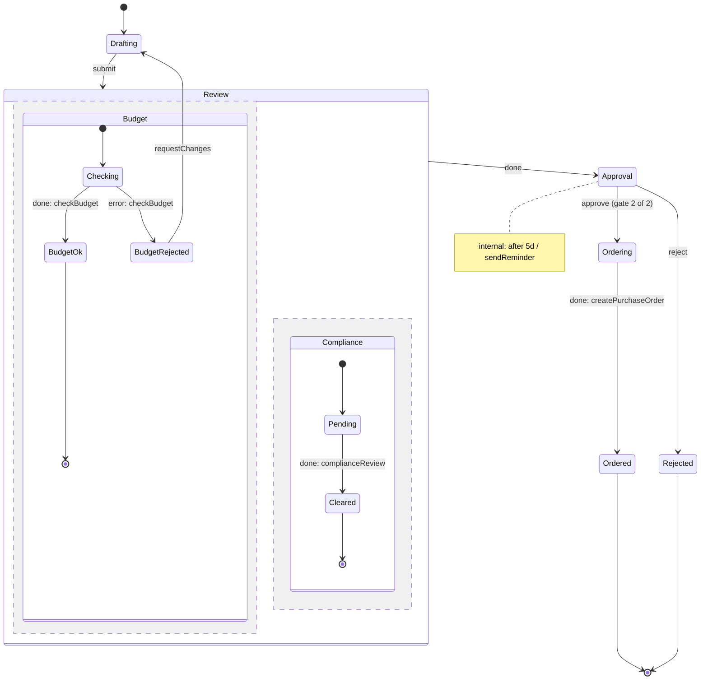

<!-- Generated by Maquettiste (process-docs/process-page). Do not edit; changes are overwritten. -->

# Purchase approval

A purchase request checked for budget and compliance in parallel, approved by two signers and ordered.

| | |
| --- | --- |
| Name | `PurchaseApproval` |
| Domain | `Purchasing` |
| Use | orchestration |
| Subject | `PurchaseRequest` |
| Initial state | `Drafting` |

## Diagram

## States

| State | Type | Details |
| --- | --- | --- |
| `Drafting` | atomic |  |
| `Review` | parallel |  |
| `Review.Budget` | compound | initial `Checking`; region 1 of `Review` |
| `Review.Budget.Checking` | atomic | invokes `checkBudget` (service) |
| `Review.Budget.BudgetOk` | final |  |
| `Review.Budget.BudgetRejected` | atomic |  |
| `Review.Compliance` | compound | initial `Pending`; region 2 of `Review` |
| `Review.Compliance.Pending` | atomic | invokes `complianceReview` (human-task) |
| `Review.Compliance.Cleared` | final |  |
| `Approval` | atomic |  |
| `Ordering` | atomic | invokes `createPurchaseOrder` (service) |
| `Ordered` | final |  |
| `Rejected` | final |  |

## Transitions

In priority order: among the transitions of one source and one trigger, the first whose guard holds is taken.

| # | Source | Trigger | Guard | Targets | Actions | Gate |
| --- | --- | --- | --- | --- | --- | --- |
| 1 | `Drafting` | event `submit` |  | `Review` |  |  |
| 2 | `Review.Budget.Checking` | done of `checkBudget` |  | `Review.Budget.BudgetOk` |  |  |
| 3 | `Review.Budget.Checking` | error of `checkBudget` |  | `Review.Budget.BudgetRejected` |  |  |
| 4 | `Review.Budget.BudgetRejected` | event `requestChanges` |  | `Drafting` |  |  |
| 5 | `Review.Compliance.Pending` | done of `complianceReview` |  | `Review.Compliance.Cleared` |  |  |
| 6 | `Review` | done |  | `Approval` |  |  |
| 7 | `Approval` | event `approve` |  | `Ordering` |  | `purchaseApproval` (2 of 2) |
| 8 | `Approval` | event `reject` |  | `Rejected` |  |  |
| 9 | `Approval` | after `P5D` |  | none (stays in the source) | `sendReminder` |  |
| 10 | `Ordering` | done of `createPurchaseOrder` |  | `Ordered` |  |  |

## Gates

A gated transition fires on the occurrence of its event that completes the gate; each earlier occurrence records one signature
and changes no state. Leaving the source state discards the signatures.

### Purchase approval

- Name: `purchaseApproval`
- On: transition 7, event `approve` from `Approval` to `Ordering`
- Signatures required: 2, from [Approver](../actors/approver.md), [FinanceController](../actors/finance-controller.md)
- Required actors: at least one signature from each of [FinanceController](../actors/finance-controller.md)
- Repeat signer: not allowed (each signature from a different person)
- Reason: optional
- Meanings: `approved` (Approved for purchase)

The audit record, one per signature attempt and per outcome of the gate:

| Field | Type | Required | Values | Description |
| --- | --- | --- | --- | --- |
| `instance` | `string` | yes |  | The process instance's identity, supplied by the host. |
| `process` | `id` | yes |  | The process. |
| `gate` | `id` | yes |  | The gate. |
| `transition` | `id` | yes |  | The gated transition. |
| `sequence` | `int64` | yes |  | The record's order within the instance. |
| `signer` | `string` | no |  | The signing person's identity, supplied by the host (never an actor id); none on a discarded record. |
| `actor` | `id` | no |  | The actor the signer signs as (one of the gate's signers); none on a discarded record. |
| `meaning` | `id` | no |  | The meaning of the signature; none on a discarded record. |
| `reason` | `text` | no |  | The signature's reason, when given. |
| `at` | `datetimeoffset` | yes |  | When the record was made, from the host's clock. |
| `outcome` | `string` | yes | `signed`, `completed`, `refused`, `discarded` | signed, completed, refused (an attempt the gate did not count) or discarded (the source state was exited). |
| `costCentre` | `string` | no |  |  |

## Events

| Event | Raised by | Payload | Transitions | Description |
| --- | --- | --- | --- | --- |
| `submit` | [Requester](../actors/requester.md), [BudgetHolder](../actors/budget-holder.md) |  | 1 |  |
| `requestChanges` | [Requester](../actors/requester.md), [BudgetHolder](../actors/budget-holder.md) |  | 4 |  |
| `approve` | [Approver](../actors/approver.md), [FinanceController](../actors/finance-controller.md) |  | 7 |  |
| `reject` | [Approver](../actors/approver.md), [FinanceController](../actors/finance-controller.md) | `reason` `text` (required) | 8 |  |

## Context

The data a running instance carries.

| Attribute | Type | Required | Default | Description |
| --- | --- | --- | --- | --- |
| `amount` | `decimal` | no | `0` |  |
| `reminders` | `int32` | no | `0` |  |

## Actions

| Action | Expression | Raises | Used by | Description |
| --- | --- | --- | --- | --- |
| `sendReminder` | `({ reminders: context.reminders + 1 })` |  | transition 9 |  |

## Invokes

Started when their state is entered and cancelled when it is left.

| Invoke | Type | State | Performed by | Description |
| --- | --- | --- | --- | --- |
| `checkBudget` | service | `Review.Budget.Checking` |  |  |
| `complianceReview` | human-task | `Review.Compliance.Pending` | [ComplianceOfficer](../actors/compliance-officer.md) |  |
| `createPurchaseOrder` | service | `Ordering` | [ProcurementSystem](../actors/procurement-system.md) |  |

## Actors

| Actor | Type | Raises | Signs | Tasks |
| --- | --- | --- | --- | --- |
| [Approver](../actors/approver.md) | role | `approve`, `reject` | `purchaseApproval` |  |
| [BudgetHolder](../actors/budget-holder.md) | person | `submit`, `requestChanges` |  |  |
| [ComplianceOfficer](../actors/compliance-officer.md) | role |  |  | `complianceReview` |
| [FinanceController](../actors/finance-controller.md) | role | `approve`, `reject` | `purchaseApproval` (required) |  |
| [ProcurementSystem](../actors/procurement-system.md) | external-system |  |  | `createPurchaseOrder` |
| [Requester](../actors/requester.md) | role | `submit`, `requestChanges` |  |  |

## Scenarios

- [Budget rejected](purchase-approval/budget-rejected.md): 3 steps, ends active
- [Changes requested loop](purchase-approval/changes-requested.md): 4 steps, ends active
- [Compliance first, then budget](purchase-approval/compliance-first-then-budget.md): 3 steps, ends active
- [Happy path](purchase-approval/happy-path.md): 6 steps, ends final
- [Rejection with reason](purchase-approval/rejection-with-reason.md): 4 steps, ends final
- [Reminder after five days](purchase-approval/reminder-after-five-days.md): 4 steps, ends active
