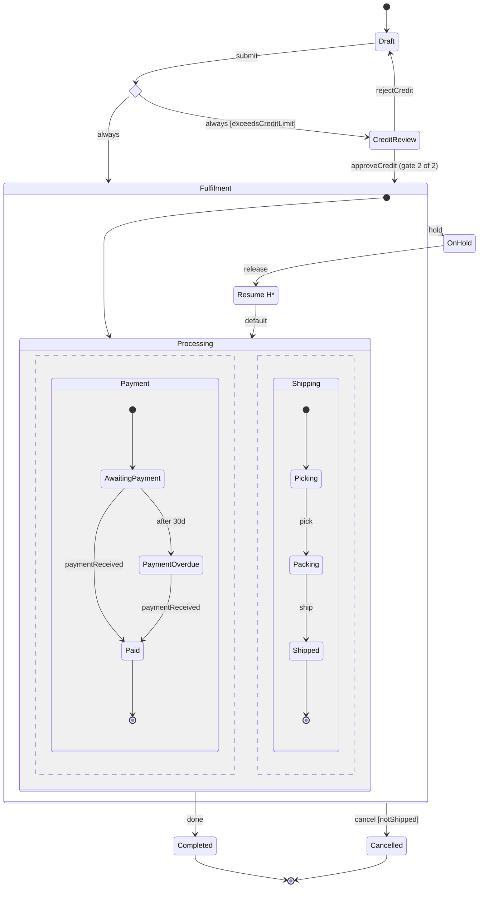

<!-- Generated by Maquettiste (process-docs/process-page). Do not edit; changes are overwritten. -->

# Sales order lifecycle

From draft through a credit check and fulfilment to completion.

| | |
| --- | --- |
| Name | `SalesOrderLifecycle` |
| Domain | `Sales` |
| Use | lifecycle |
| Subject | `SalesOrder` |
| Initial state | `Draft` |

## Lifecycle

The attribute `SalesOrder.status` of `SalesOrder` holds the top-level state, as a member of the enum `SalesOrderStatus`; a nested state counts as its top-level ancestor.

| State | Enum member |
| --- | --- |
| `Draft` | `Draft` |
| `CreditReview` | `CreditReview` |
| `Fulfilment` | `Fulfilment` |
| `OnHold` | `OnHold` |
| `Completed` | `Completed` |
| `Cancelled` | `Cancelled` |

## Diagram

## States

| State | Type | Details |
| --- | --- | --- |
| `Draft` | atomic |  |
| `CreditCheck` | choice |  |
| `CreditReview` | atomic |  |
| `Fulfilment` | compound | initial `Processing`; Wraps the parallel regions so that the deep history state belongs to a compound state. |
| `Fulfilment.Processing` | parallel |  |
| `Fulfilment.Processing.Payment` | compound | initial `AwaitingPayment`; region 1 of `Fulfilment.Processing` |
| `Fulfilment.Processing.Payment.AwaitingPayment` | atomic |  |
| `Fulfilment.Processing.Payment.PaymentOverdue` | atomic |  |
| `Fulfilment.Processing.Payment.Paid` | final |  |
| `Fulfilment.Processing.Shipping` | compound | initial `Picking`; region 2 of `Fulfilment.Processing` |
| `Fulfilment.Processing.Shipping.Picking` | atomic |  |
| `Fulfilment.Processing.Shipping.Packing` | atomic |  |
| `Fulfilment.Processing.Shipping.Shipped` | final |  |
| `Fulfilment.Resume` | history | deep history, default `Fulfilment.Processing` |
| `OnHold` | atomic |  |
| `Completed` | final |  |
| `Cancelled` | final |  |

## Transitions

In priority order: among the transitions of one source and one trigger, the first whose guard holds is taken.

| # | Source | Trigger | Guard | Targets | Actions | Gate |
| --- | --- | --- | --- | --- | --- | --- |
| 1 | `Draft` | event `submit` |  | `CreditCheck` |  |  |
| 2 | `CreditCheck` | always | `exceedsCreditLimit` | `CreditReview` |  |  |
| 3 | `CreditCheck` | always |  | `Fulfilment` |  |  |
| 4 | `CreditReview` | event `approveCredit` |  | `Fulfilment` |  | `creditApproval` (2 of 2) |
| 5 | `CreditReview` | event `rejectCredit` |  | `Draft` |  |  |
| 6 | `Fulfilment.Processing.Payment.AwaitingPayment` | event `paymentReceived` |  | `Fulfilment.Processing.Payment.Paid` |  |  |
| 7 | `Fulfilment.Processing.Payment.AwaitingPayment` | after `P30D` |  | `Fulfilment.Processing.Payment.PaymentOverdue` |  |  |
| 8 | `Fulfilment.Processing.Payment.PaymentOverdue` | event `paymentReceived` |  | `Fulfilment.Processing.Payment.Paid` |  |  |
| 9 | `Fulfilment.Processing.Shipping.Picking` | event `pick` |  | `Fulfilment.Processing.Shipping.Packing` |  |  |
| 10 | `Fulfilment.Processing.Shipping.Packing` | event `ship` |  | `Fulfilment.Processing.Shipping.Shipped` |  |  |
| 11 | `Fulfilment.Processing` | done |  | `Completed` |  |  |
| 12 | `Fulfilment` | event `hold` |  | `OnHold` |  |  |
| 13 | `OnHold` | event `release` |  | `Fulfilment.Resume` |  |  |
| 14 | `Fulfilment` | event `cancel` | `notShipped` | `Cancelled` |  |  |

## Gates

A gated transition fires on the occurrence of its event that completes the gate; each earlier occurrence records one signature
and changes no state. Leaving the source state discards the signatures.

### Credit approval

- Name: `creditApproval`
- On: transition 4, event `approveCredit` from `CreditReview` to `Fulfilment`
- Signatures required: 2, from [CreditManager](../actors/credit-manager.md), [FinanceDirector](../actors/finance-director.md)
- Required actors: at least one signature from each of [CreditManager](../actors/credit-manager.md)
- Repeat signer: not allowed (each signature from a different person)
- Reason: required with each signature
- Meanings: `creditApproved` (Credit approved)

The audit record, one per signature attempt and per outcome of the gate:

| Field | Type | Required | Values | Description |
| --- | --- | --- | --- | --- |
| `instance` | `string` | yes |  | The process instance's identity, supplied by the host. |
| `process` | `id` | yes |  | The process. |
| `gate` | `id` | yes |  | The gate. |
| `transition` | `id` | yes |  | The gated transition. |
| `sequence` | `int64` | yes |  | The record's order within the instance. |
| `signer` | `string` | no |  | The signing person's identity, supplied by the host (never an actor id); none on a discarded record. |
| `actor` | `id` | no |  | The actor the signer signs as (one of the gate's signers); none on a discarded record. |
| `meaning` | `id` | no |  | The meaning of the signature; none on a discarded record. |
| `reason` | `text` | no |  | The signature's reason: required on every signature. |
| `at` | `datetimeoffset` | yes |  | When the record was made, from the host's clock. |
| `outcome` | `string` | yes | `signed`, `completed`, `refused`, `discarded` | signed, completed, refused (an attempt the gate did not count) or discarded (the source state was exited). |

## Events

| Event | Raised by | Payload | Transitions | Description |
| --- | --- | --- | --- | --- |
| `submit` | any actor |  | 1 |  |
| `approveCredit` | [CreditManager](../actors/credit-manager.md), [FinanceDirector](../actors/finance-director.md) |  | 4 |  |
| `rejectCredit` | [CreditManager](../actors/credit-manager.md), [FinanceDirector](../actors/finance-director.md) |  | 5 |  |
| `paymentReceived` | any actor |  | 6, 8 |  |
| `pick` | any actor |  | 9 |  |
| `ship` | any actor |  | 10 |  |
| `hold` | any actor |  | 12 |  |
| `release` | any actor |  | 13 |  |
| `cancel` | any actor |  | 14 |  |

## Context

The data a running instance carries.

| Attribute | Type | Required | Default | Description |
| --- | --- | --- | --- | --- |
| `total` | `decimal` | no | `0` |  |
| `creditLimit` | `decimal` | no | `0` |  |

## Guards

| Guard | Expression | Used by transitions | Description |
| --- | --- | --- | --- |
| `exceedsCreditLimit` | `context.total > context.creditLimit` | 2 |  |
| `notShipped` | none: a named stub the host answers | 14 | Whether nothing has left the warehouse yet; answered by the host. |

## Actors

| Actor | Type | Raises | Signs | Tasks |
| --- | --- | --- | --- | --- |
| [CreditManager](../actors/credit-manager.md) | role | `approveCredit`, `rejectCredit` | `creditApproval` (required) |  |
| [FinanceDirector](../actors/finance-director.md) | role | `approveCredit`, `rejectCredit` | `creditApproval` |  |

## Scenarios

- [Cancel before shipping](sales-order-lifecycle/cancel-before-shipping.md): 2 steps, ends final
- [Cancel refused after shipping](sales-order-lifecycle/cancel-refused-after-shipping.md): 4 steps, ends active
- [Credit approved with two signatures](sales-order-lifecycle/credit-approved.md): 3 steps, ends active
- [Credit rejected and resubmitted](sales-order-lifecycle/credit-rejected-and-resubmitted.md): 3 steps, ends active
- [Hold and release](sales-order-lifecycle/hold-and-release.md): 4 steps, ends active
- [Payment overdue by time](sales-order-lifecycle/payment-overdue.md): 3 steps, ends active
- [Repeat signer refused](sales-order-lifecycle/repeat-signer-refused.md): 3 steps, ends active
- [Small order](sales-order-lifecycle/small-order.md): 4 steps, ends final
